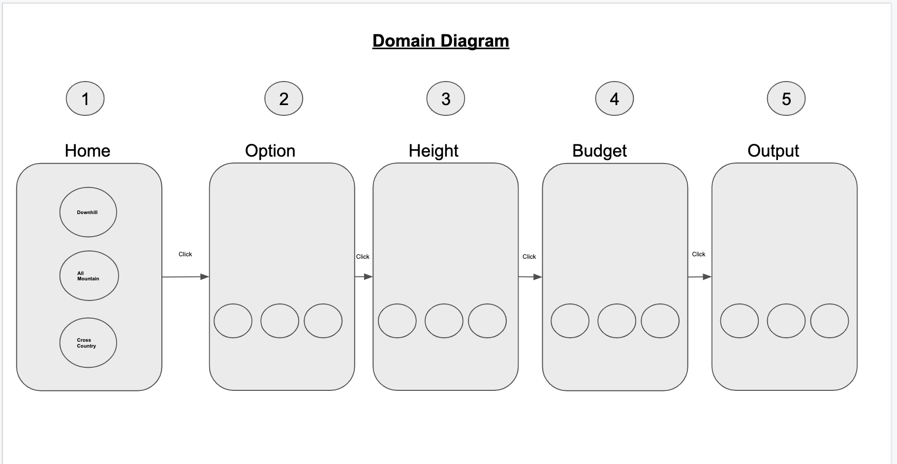

# The Bike Selector App

## Authors

- Brock-Lee Thomas
- Rolando Haynes
- Dominique Augurson
- Major "Spencer" Lazzar
- Taylor Johnson

## Description

An interactive web app designed to help individuals interested in cycling figure out what type of bike is the right fit for their intended use.

## Solution

Our app will provide users with a tiered interactive menu that will reducibly lead them to the correct bicycle for their riding intentions.
It will ask first for their intended terrain (road, mountain, park). Next it will refine that selection into sub-categories to land on the specialized bike configuration for their intended riding. The app will have a form for the user to input their height and inseam measurement. This information will be stored in local memory and run through script to produce the proper frame size for the user. The app will also have a drop down menu with a range of budgets to select from. Based on the combination of forms and selections, the final bike presentation page will display to the user what specific bike type is right for them, what size of frame and what kind of options to expect their budget.

## Version Log

### 1.0.0

Project start. Basic layout and file organization. Creation of repo and branch structure. 

Your project should be documented on GitHub and within your code base.

On GitHub, create a README.md file as the main landing document of your repository. Continue to update it as your project evolves.

At a minimum, your README.md should include the following:

The name of the project
Names of the team members
A description of the project
The overall problem domain and how the project solves those problems
Semantic versioning, beginning with version 1.0.0 and incremented as changes are made
A list of any libraries, frameworks, or packages that your application requires in order to properly function. If needed, provide instructions that the user may need to follow in order to get your application up and running on their own computer.
Within your code, document with meaningful comments. For example, a comment might provide an overview of what the function beneath it is doing, or describe the relationship between two variables.

Comments should be updated as necessary. Remove all unused, commented-out code before committing to GitHub.

## Domain Modeling

### Domain Diagram

## WireFrame

### Landing Page

 

### Test Page

 

### Results Page

 

### Data Page

 

### About Us Page
